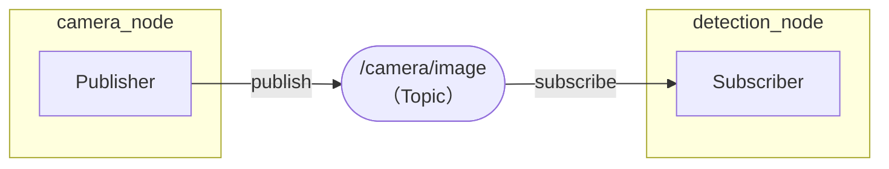
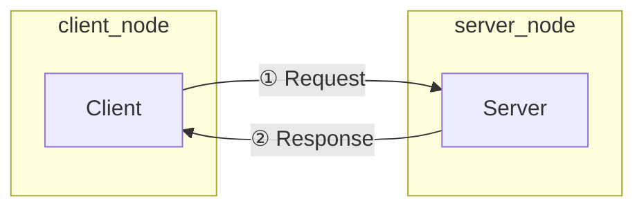
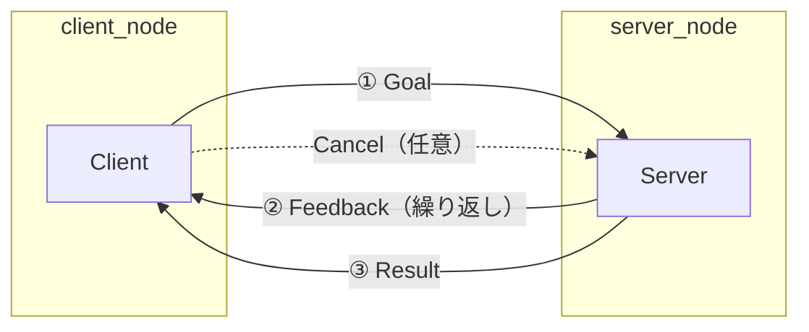
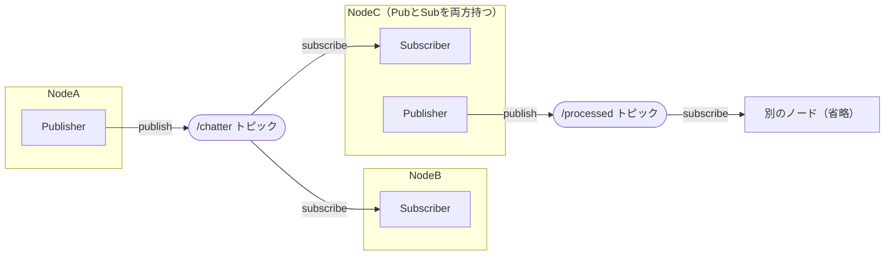

# 1章: ROS2 とは

## ROS2 の概要

**ROS2（Robot Operating System 2）** は，ロボットソフトウェア開発のための「ミドルウェア」です．
OS という名前がついていますが，Windows や Linux のような OS ではなく，Linux の上で動作するソフトウェア基盤です．

### なぜ ROS2 を使うのか？

ロボットのソフトウェアには，カメラ・センサー・モーターなど，異なるハードウェアを連携させる必要があります．これを一から作ると非常に大変です．ROS2 を使うと：

- **部品化**：センサー処理・運動制御・認識などを独立したプログラムとして書ける
- **通信の仕組みが標準化**：部品間のデータ受け渡しが簡単に書ける
- **豊富なライブラリ**：カメラ・LiDAR・ロボットアームなどの既製部品が多数ある
- **可視化ツール**：`rviz2`・`rqt` などのデバッグツールがある

### ROS1 との違い

ROS1（Noetic など）から ROS2 になって大きく変わった点があります．

| 項目 | ROS1 | ROS2 |
|------|------|------|
| 中央マスター | `roscore` が必須 | 不要（DDS ベースの分散通信）|
| リアルタイム対応 | なし | あり（RTOS との統合が可能）|
| セキュリティ | なし | DDS-Security で暗号化・認証 |
| ビルドシステム | catkin | ament_cmake + colcon |
| C++ ライブラリ | `roscpp` | `rclcpp` |
| launch ファイル | XML | Python |
| パラメータ | 中央パラメータサーバー | ノード内で宣言・管理 |

### このチュートリアルで使う ROS2 バージョン

**ROS2 Humble Hawksbill**（Ubuntu 22.04 向け）を使います．Humble は LTS（長期サポート）リリースで，2027 年 5 月まで公式サポートが続きます．

---

## 基本概念

ROS2 を理解するうえで最初に押さえるべき 5 つの概念を説明します．

### ノード（Node）

**ノード = 1 つのプログラム（プロセス）** のことです．

ROS2 では 1 つの大きなプログラムを書くのではなく，小さなプログラム（ノード）をたくさん起動して，それらを連携させます．

```
例：
  camera_node      ← カメラ画像を取得するプログラム
  detection_node   ← 画像から物体を検出するプログラム
  motor_node       ← モーターを制御するプログラム
```

それぞれのノードは独立して動作し，お互いにデータを送り合います．

### トピック（Topic）

**トピック = データの流れ道（チャンネル）** のことです．

ノード同士はトピックを通じてデータをやり取りします．



- データを送る側を **Publisher（パブリッシャー）**
- データを受け取る側を **Subscriber（サブスクライバー）**

と呼びます．トピックを購読（subscribe）している全ノードにデータが届きます（放送のようなイメージ）．

### サービス（Service）

**サービス = 要求・応答型の通信** のことです．

トピックが「送りっぱなし（応答なし）」なのに対し，サービスは **1回の要求に対して必ず1回の応答が返ってくる** 通信です．



例：「今の位置を教えて」→「現在地は (x=1.0, y=2.0) です」

### アクション（Action）

**アクション = 長時間処理向けの通信** のことです．

サービスが「1回の要求・応答で完結」するのに対し，アクションは **処理中に何度もフィードバックが届き，途中でキャンセルもできる** 通信です．



例：「目標地点まで移動して」→「30%…50%…80%…」→「到着しました」

### メッセージ（Message）

**メッセージ = 各通信方式でやり取りするデータの型** のことです．

| 通信方式 | ファイル形式 | 定義内容 |
|---------|------------|---------|
| トピック | `.msg` | 送受信するデータの構造 |
| サービス | `.srv` | Request 型 + Response 型 |
| アクション | `.action` | Goal 型 + Feedback 型 + Result 型 |

ROS2 では型名の名前空間が変わりました：

| ROS1 | ROS2 |
|------|------|
| `std_msgs::String` | `std_msgs::msg::String` |
| `sensor_msgs::Image` | `sensor_msgs::msg::Image` |
| `geometry_msgs::Twist` | `geometry_msgs::msg::Twist` |

### パラメータ（Parameter）

**パラメータ = プログラムの設定値** のことです．

ROS2 では各ノードが自分のパラメータを管理します（ROS1 のような中央パラメータサーバーはありません）．

---

## ROS2 の全体像

ROS1 では `roscore`（ROS マスター）が必須でしたが，ROS2 では **DDS（Data Distribution Service）** という標準規格を使って，マスターなしでノード同士が直接通信します．



`roscore` を起動しなくてよいのが ROS2 の大きな特徴です．

---

## よく使うコマンドの一覧（参考）

実際の使い方は各章で説明します．ここでは「こういうコマンドがある」と把握しておくだけで大丈夫です．

| コマンド | 用途 |
|---------|------|
| `ros2 run <pkg> <node>` | ノードを起動する |
| `ros2 launch <pkg> <file.launch.py>` | launch ファイルで複数ノードを起動 |
| `ros2 node list` | 起動中のノード一覧 |
| `ros2 topic list` | 現在のトピック一覧 |
| `ros2 topic echo /topic_name` | トピックの内容をリアルタイム表示 |
| `ros2 interface show <型名>` | メッセージ型の定義を確認 |
| `ros2 service list` | 現在のサービス一覧 |
| `ros2 param list` | 現在のパラメータ一覧 |

---

次の章では，実際に ROS2 をインストールして使える状態にします．

[→ 2章: 環境構築](02_setup.md)
