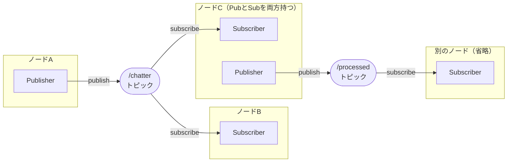

# 4章: Publisher / Subscriber

ROS2 の最も基本的な通信方式である **トピック通信** を実装します．

---

## トピック通信の仕組みを理解する

### 4つの用語

| 用語 | 意味 |
|------|------|
| **ノード** | ROS2 上で動くプログラムの単位 |
| **トピック** | メッセージをやり取りするための「名前付きチャンネル」 |
| **Publisher** | あるトピックにメッセージを**送る**インターフェース |
| **Subscriber** | あるトピックからメッセージを**受け取る**インターフェース |

### 重要：Publisher / Subscriber はノードの「種類」ではない

1 つのノードが Publisher と Subscriber の**両方**を同時に持つことができます．



---

## この章でやること

1. `/chatter` トピックに文字列を送る **talker ノード**を作る
2. `/chatter` トピックから文字列を受け取る **listener ノード**を作る
3. 2つのノードを起動して通信させる
4. Publisher と Subscriber の**両方**を持つ **relay ノード**を作る

---

## Publisher を持つノードを書く（talker.cpp）

`~/ros2_ws/src/ros_tutorial/src/talker.cpp` を作成します．

```cpp
#include "rclcpp/rclcpp.hpp"
#include "std_msgs/msg/string.hpp"

int main(int argc, char * argv[])
{
    // ROS2 の初期化（必ず最初に呼ぶ）
    rclcpp::init(argc, argv);

    // ノードの作成（"talker" という名前）
    auto node = rclcpp::Node::make_shared("talker");

    // Publisher の作成
    // "chatter" というトピック名で std_msgs::msg::String 型のメッセージを送る
    // 第2引数はキューサイズ（送れなかったメッセージを何個まで保持するか）
    auto pub = node->create_publisher<std_msgs::msg::String>("chatter", 10);

    // ループの周期を 10Hz に設定
    rclcpp::Rate rate(10);

    int count = 0;
    while (rclcpp::ok())   // ROS2 が正常に動いている間はループ
    {
        // メッセージの作成
        auto msg = std_msgs::msg::String();
        msg.data = "hello world " + std::to_string(count++);

        RCLCPP_INFO(node->get_logger(), "%s", msg.data.c_str());

        // メッセージの送信
        pub->publish(msg);

        rclcpp::spin_some(node);
        rate.sleep();
    }

    rclcpp::shutdown();
    return 0;
}
```

### コードのポイント

| コード | 意味 |
|--------|------|
| `rclcpp::init(argc, argv)` | ROS2 システムを初期化する |
| `rclcpp::Node::make_shared("talker")` | "talker" という名前のノードを作る |
| `node->create_publisher<std_msgs::msg::String>("chatter", 10)` | "chatter" トピックへの Publisher を作る |
| `pub->publish(msg)` | メッセージを送信 |
| `rclcpp::Rate rate(10)` / `rate.sleep()` | 10Hz を維持するためのタイマー |
| `rclcpp::spin_some(node)` | コールバックを処理する（Publisher のみのノードでも記述する） |
| `rclcpp::shutdown()` | ROS2 システムを終了する |

> **ROS1 との主な違い**:
> - `ros::NodeHandle nh` → `rclcpp::Node::make_shared("talker")`
> - `nh.advertise<std_msgs::String>("chatter", 10)` → `node->create_publisher<std_msgs::msg::String>("chatter", 10)`
> - メッセージ型: `std_msgs::String` → `std_msgs::msg::String`
> - `ros::ok()` → `rclcpp::ok()`
> - `ros::spinOnce()` → `rclcpp::spin_some(node)`

---

## Subscriber を持つノードを書く（listener.cpp）

`~/ros2_ws/src/ros_tutorial/src/listener.cpp` を作成します．

```cpp
#include "rclcpp/rclcpp.hpp"
#include "std_msgs/msg/string.hpp"

int main(int argc, char * argv[])
{
    rclcpp::init(argc, argv);
    auto node = rclcpp::Node::make_shared("listener");

    // Subscriber の作成
    // "chatter" トピックを購読し，受信したらラムダ式を呼ぶ
    auto sub = node->create_subscription<std_msgs::msg::String>(
        "chatter", 10,
        [node](const std_msgs::msg::String::SharedPtr msg) {
            RCLCPP_INFO(node->get_logger(), "受信: [%s]", msg->data.c_str());
        });

    // spin()：コールバックが呼ばれるのを待ち続ける
    rclcpp::spin(node);

    rclcpp::shutdown();
    return 0;
}
```

### コールバック関数について

ROS2 ではコールバックに **ラムダ式** をよく使います．

```cpp
[node](const std_msgs::msg::String::SharedPtr msg) {
    // msg が届いたときの処理
}
```

ラムダ式の `[node]` は「ラムダ式の中で `node` 変数を使う」という宣言です．

もちろん，ROS1 と同様に通常の関数をコールバックとして使うこともできます：

```cpp
void chatterCallback(const std_msgs::msg::String::SharedPtr msg)
{
    RCLCPP_INFO(rclcpp::get_logger("listener"), "受信: [%s]", msg->data.c_str());
}

// ...
auto sub = node->create_subscription<std_msgs::msg::String>(
    "chatter", 10, chatterCallback);
```

> **ROS1 との違い**:
> - コールバック引数: `const std_msgs::String::ConstPtr&` → `const std_msgs::msg::String::SharedPtr`
> - `ros::spin()` → `rclcpp::spin(node)`

---

## Publisher と Subscriber を両方持つノード（relay.cpp）

`~/ros2_ws/src/ros_tutorial/src/relay.cpp` を作成します．

```cpp
#include "rclcpp/rclcpp.hpp"
#include "std_msgs/msg/string.hpp"

int main(int argc, char * argv[])
{
    rclcpp::init(argc, argv);
    auto node = rclcpp::Node::make_shared("relay");

    // Publisher と Subscriber を同じノードに持つ
    auto pub = node->create_publisher<std_msgs::msg::String>("chatter_relay", 10);

    auto sub = node->create_subscription<std_msgs::msg::String>(
        "chatter", 10,
        [node, pub](const std_msgs::msg::String::SharedPtr msg) {
            RCLCPP_INFO(node->get_logger(), "中継: [%s]", msg->data.c_str());
            pub->publish(*msg);
        });

    rclcpp::spin(node);
    rclcpp::shutdown();
    return 0;
}
```

---

## CMakeLists.txt の更新

`~/ros2_ws/src/ros_tutorial/CMakeLists.txt` の `ament_package()` の前に追記します：

```cmake
add_executable(talker src/talker.cpp)
ament_target_dependencies(talker rclcpp std_msgs)

add_executable(listener src/listener.cpp)
ament_target_dependencies(listener rclcpp std_msgs)

add_executable(relay src/relay.cpp)
ament_target_dependencies(relay rclcpp std_msgs)

install(TARGETS
  talker
  listener
  relay
  DESTINATION lib/${PROJECT_NAME})
```

---

## ビルドと実行

### ビルド

```bash
cd ~/ros2_ws
colcon build --packages-select ros_tutorial
source install/setup.bash
```

### talker と listener の通信確認（ターミナル 2 つ）

**ターミナル 1：talker**
```bash
ros2 run ros_tutorial talker
```

出力例：
```
[INFO] [XXXX] [talker]: hello world 0
[INFO] [XXXX] [talker]: hello world 1
```

**ターミナル 2：listener**
```bash
ros2 run ros_tutorial listener
```

出力例：
```
[INFO] [XXXX] [listener]: 受信: [hello world 0]
[INFO] [XXXX] [listener]: 受信: [hello world 1]
```

> **ROS1 との違い**: `roscore` を起動せずに 2 つのターミナルだけで動作します．

### relay ノードの動作確認

talker を起動した状態で，別のターミナルで relay を起動します：

```bash
ros2 run ros_tutorial relay
```

さらに別のターミナルで `/chatter_relay` の内容を確認します：

```bash
ros2 topic echo /chatter_relay
```

---

## デバッグコマンドを試す

### ノード一覧の確認

```bash
ros2 node list
```

出力例（talker・listener・relay をすべて起動している場合）：
```
/listener
/relay
/talker
```

### トピック一覧の確認

```bash
ros2 topic list
```

出力例：
```
/chatter
/chatter_relay
/parameter_events
/rosout
```

### トピックの内容をリアルタイムで確認

```bash
ros2 topic echo /chatter
```

### ノードとトピックの接続を可視化

```bash
rqt_graph
```

### 送信レートの確認

```bash
ros2 topic hz /chatter
```

出力：
```
average rate: 10.000
```

---

## よくある疑問

### `spin_some()` と `spin()` の違いは？

| 関数 | 動作 |
|------|------|
| `rclcpp::spin(node)` | コールバックを待ち続ける（終了しない） |
| `rclcpp::spin_some(node)` | コールバックを処理して即座に返る |

talker では自分でループを書くため `spin_some()` を使い，listener や relay では待ち続けるだけでよいため `spin()` を使います．

### 1つのノードに Publisher や Subscriber はいくつでも作れる？

はい，何個でも作れます．実際のロボットシステムでは，1つのノードが複数のトピックを送受信することが普通です．

---

[→ 5章: サービス](05_service.md)
