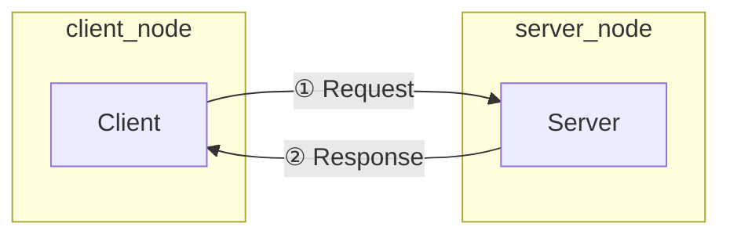

# 5章: サービス

ROS2 の通信方式には，前章で学んだ**トピック**のほかに**サービス**があります．

---

## トピックとサービスの違い

| 比較項目 | トピック | サービス |
|---------|---------|---------|
| 通信モデル | 非同期（送りっぱなし）| 非同期（要求を送り，応答を受け取る）|
| 向き | 単方向（Publisher → Subscriber）| 双方向（Client ⇄ Server）|
| 主な用途 | センサーデータの連続配信 | 計算依頼・設定変更・一時的な操作 |
| 応答 | なし | あり |



---

## サービス定義ファイル（.srv）の作成

サービスの型は `.srv` ファイルで定義します．`---` より上が**リクエスト**，下が**レスポンス**です．

```bash
mkdir -p ~/ros2_ws/src/ros_tutorial/srv
```

`~/ros2_ws/src/ros_tutorial/srv/AddTwoInts.srv` を作成：

```
int64 a
int64 b
---
int64 sum
```

---

## ビルド設定の変更

### CMakeLists.txt の変更

`find_package(ament_cmake REQUIRED)` などの下に追加します：

```cmake
find_package(rosidl_default_generators REQUIRED)

rosidl_generate_interfaces(${PROJECT_NAME}
  "srv/AddTwoInts.srv"
  DEPENDENCIES std_msgs
)
```

さらに，サーバー・クライアントの実行ファイルにインターフェースをリンクします：

```cmake
# インターフェースのタイプサポートターゲットを取得
rosidl_get_typesupport_target(cpp_typesupport_target ${PROJECT_NAME} "rosidl_typesupport_cpp")

add_executable(add_two_ints_server src/add_two_ints_server.cpp)
ament_target_dependencies(add_two_ints_server rclcpp)
target_link_libraries(add_two_ints_server ${cpp_typesupport_target})

add_executable(add_two_ints_client src/add_two_ints_client.cpp)
ament_target_dependencies(add_two_ints_client rclcpp)
target_link_libraries(add_two_ints_client ${cpp_typesupport_target})

install(TARGETS
  add_two_ints_server
  add_two_ints_client
  DESTINATION lib/${PROJECT_NAME})
```

### package.xml の変更

```xml
<build_depend>rosidl_default_generators</build_depend>
<exec_depend>rosidl_default_runtime</exec_depend>
<member_of_group>rosidl_interface_packages</member_of_group>
```

> **ROS1 との比較**: ROS1 の `message_generation` / `message_runtime` が ROS2 では `rosidl_default_generators` / `rosidl_default_runtime` に対応します．

---

## サービスサーバーを実装する

`~/ros2_ws/src/ros_tutorial/src/add_two_ints_server.cpp` を作成：

```cpp
#include "rclcpp/rclcpp.hpp"
#include "ros_tutorial/srv/add_two_ints.hpp"

using AddTwoInts = ros_tutorial::srv::AddTwoInts;

// コールバック：クライアントからリクエストが届いたとき呼ばれる
void add(const std::shared_ptr<AddTwoInts::Request> request,
         std::shared_ptr<AddTwoInts::Response> response)
{
    response->sum = request->a + request->b;
    RCLCPP_INFO(rclcpp::get_logger("add_two_ints_server"),
                "リクエスト: a=%ld, b=%ld → レスポンス: sum=%ld",
                request->a, request->b, response->sum);
}

int main(int argc, char * argv[])
{
    rclcpp::init(argc, argv);
    auto node = rclcpp::Node::make_shared("add_two_ints_server");

    // サービスを公開する
    auto service = node->create_service<AddTwoInts>("add_two_ints", &add);
    RCLCPP_INFO(node->get_logger(), "add_two_ints サービスの準備完了");

    rclcpp::spin(node);
    rclcpp::shutdown();
    return 0;
}
```

### コードのポイント

| コード | 意味 |
|--------|------|
| `#include "ros_tutorial/srv/add_two_ints.hpp"` | 自動生成されたサービスのヘッダ（ファイル名は snake_case）|
| `ros_tutorial::srv::AddTwoInts` | サービス型（名前空間に `::srv::` が入る）|
| `node->create_service<AddTwoInts>("add_two_ints", &add)` | サービスを公開し，リクエストが来たら `add` を呼ぶ |
| `const std::shared_ptr<AddTwoInts::Request> request` | クライアントから受け取った値 |
| `std::shared_ptr<AddTwoInts::Response> response` | クライアントに返す値（ここに書き込む）|

> **型名の変換規則**: `.srv` ファイル名 `AddTwoInts.srv` → ヘッダ名 `add_two_ints.hpp`（CamelCase → snake_case），型名 `ros_tutorial::srv::AddTwoInts`（`::srv::` が入る）

---

## サービスクライアントを実装する

`~/ros2_ws/src/ros_tutorial/src/add_two_ints_client.cpp` を作成：

```cpp
#include "rclcpp/rclcpp.hpp"
#include "ros_tutorial/srv/add_two_ints.hpp"
#include <chrono>

using AddTwoInts = ros_tutorial::srv::AddTwoInts;

int main(int argc, char * argv[])
{
    rclcpp::init(argc, argv);

    if (argc != 3) {
        RCLCPP_INFO(rclcpp::get_logger("rclcpp"), "使い方: add_two_ints_client <a> <b>");
        return 1;
    }

    auto node = rclcpp::Node::make_shared("add_two_ints_client");
    auto client = node->create_client<AddTwoInts>("add_two_ints");

    // サービスが利用可能になるまで待機
    while (!client->wait_for_service(std::chrono::seconds(1))) {
        if (!rclcpp::ok()) {
            RCLCPP_ERROR(node->get_logger(), "待機中にシャットダウンされました");
            rclcpp::shutdown();
            return 1;
        }
        RCLCPP_INFO(node->get_logger(), "サービス待機中...");
    }

    // リクエストを作成してフィールドに値をセット
    auto request = std::make_shared<AddTwoInts::Request>();
    request->a = std::atoll(argv[1]);
    request->b = std::atoll(argv[2]);

    // 非同期でサービスを呼び出す
    auto future = client->async_send_request(request);

    // 完了まで待つ
    if (rclcpp::spin_until_future_complete(node, future) ==
        rclcpp::FutureReturnCode::SUCCESS)
    {
        RCLCPP_INFO(node->get_logger(), "結果: %ld", future.get()->sum);
    } else {
        RCLCPP_ERROR(node->get_logger(), "サービスの呼び出しに失敗しました");
    }

    rclcpp::shutdown();
    return 0;
}
```

### コードのポイント

| コード | 意味 |
|--------|------|
| `node->create_client<AddTwoInts>("add_two_ints")` | サービスクライアントを作る |
| `client->wait_for_service(std::chrono::seconds(1))` | サービスが起動するまで最大1秒待つ |
| `client->async_send_request(request)` | 非同期でリクエストを送る（`std::future` を返す）|
| `rclcpp::spin_until_future_complete(node, future)` | future が完了するまで spin する |
| `future.get()->sum` | レスポンスの値を読む |

> **ROS1 との違い**: ROS1 の `client.call(srv)` は同期（ブロッキング）でしたが，ROS2 の `async_send_request` は非同期です．`spin_until_future_complete` で完了を待ちます．

---

## ビルドと実行

```bash
cd ~/ros2_ws
colcon build --symlink-install --packages-select ros_tutorial
source install/setup.bash
```

**ターミナル 1：サーバーを起動**
```bash
ros2 run ros_tutorial add_two_ints_server
```

出力：
```
[INFO] [...] [add_two_ints_server]: add_two_ints サービスの準備完了
```

**ターミナル 2：クライアントを実行**
```bash
ros2 run ros_tutorial add_two_ints_client 3 7
```

クライアント側の出力：
```
[INFO] [...] [add_two_ints_client]: 結果: 10
```

サーバー側の出力：
```
[INFO] [...] [add_two_ints_server]: リクエスト: a=3, b=7 → レスポンス: sum=10
```

---

## ros2 service コマンド

```bash
# 利用可能なサービス一覧
ros2 service list

# サービスの型を確認
ros2 service type /add_two_ints

# コマンドラインから直接呼び出す
ros2 service call /add_two_ints ros_tutorial/srv/AddTwoInts "{a: 10, b: 20}"
```

サービス定義の確認：

```bash
ros2 interface show ros_tutorial/srv/AddTwoInts
```

---

## 補足：アクション

サービスは呼び出すと**完了まで待ち続ける**ため，移動命令のような長時間処理には不向きです．次の [6章: アクション通信](06_action.md) で実装方法を学びます．

---

[→ 6章: アクション通信](06_action.md)
