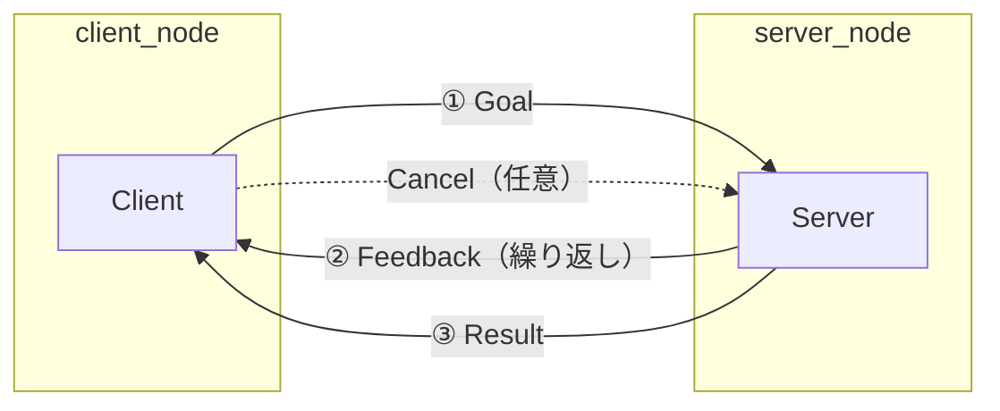

# 6章: アクション通信

サービスは「呼び出したらすぐ結果が返ってくる」処理に向いていますが，**数秒〜数分かかる処理**には不向きです．**rclcpp_action** は「進捗フィードバック」と「キャンセル」を備えた通信を提供します．

---

## 3つの通信方式の比較

| 比較項目 | トピック | サービス | アクション |
|---------|---------|---------|----------|
| 通信モデル | 非同期（送りっぱなし）| 非同期（完了まで待つ）| 非同期（進捗通知あり）|
| フィードバック | なし | なし | あり（処理中に随時通知）|
| キャンセル | なし | なし | あり |
| 主な用途 | センサーデータ配信 | 一時的な設定変更 | 移動・把持など長時間処理 |



---

## `.action` ファイルの定義

`.action` ファイルは **Goal / Result / Feedback** の 3 つのセクションを `---` で区切ります．

```bash
mkdir -p ~/ros2_ws/src/ros_tutorial/action
```

`~/ros2_ws/src/ros_tutorial/action/CountDown.action` を作成：

```
# Goal: カウントダウンの開始値
int32 target
---
# Result: 完了メッセージ
string message
---
# Feedback: 現在のカウント値
int32 remaining
```

---

## ビルド設定の変更

### CMakeLists.txt の変更

```cmake
find_package(rclcpp_action REQUIRED)
find_package(rosidl_default_generators REQUIRED)

rosidl_generate_interfaces(${PROJECT_NAME}
  "action/CountDown.action"
  DEPENDENCIES std_msgs
)

rosidl_get_typesupport_target(cpp_typesupport_target ${PROJECT_NAME} "rosidl_typesupport_cpp")

add_executable(count_down_server src/count_down_server.cpp)
ament_target_dependencies(count_down_server rclcpp rclcpp_action)
target_link_libraries(count_down_server ${cpp_typesupport_target})

add_executable(count_down_client src/count_down_client.cpp)
ament_target_dependencies(count_down_client rclcpp rclcpp_action)
target_link_libraries(count_down_client ${cpp_typesupport_target})

install(TARGETS
  count_down_server
  count_down_client
  DESTINATION lib/${PROJECT_NAME})
```

### package.xml の変更

```xml
<depend>rclcpp_action</depend>
<build_depend>rosidl_default_generators</build_depend>
<exec_depend>rosidl_default_runtime</exec_depend>
<member_of_group>rosidl_interface_packages</member_of_group>
```

---

## Action Server を実装する

`~/ros2_ws/src/ros_tutorial/src/count_down_server.cpp` を作成：

```cpp
#include "rclcpp/rclcpp.hpp"
#include "rclcpp_action/rclcpp_action.hpp"
#include "ros_tutorial/action/count_down.hpp"

using CountDown = ros_tutorial::action::CountDown;
using GoalHandle = rclcpp_action::ServerGoalHandle<CountDown>;

// ゴールを受け入れるか判断するコールバック
rclcpp_action::GoalResponse handle_goal(
    const rclcpp_action::GoalUUID &,
    std::shared_ptr<const CountDown::Goal> goal)
{
    RCLCPP_INFO(rclcpp::get_logger("count_down_server"),
                "ゴール受信: target=%d", goal->target);
    return rclcpp_action::GoalResponse::ACCEPT_AND_EXECUTE;
}

// キャンセルリクエストを受け入れるか判断するコールバック
rclcpp_action::CancelResponse handle_cancel(
    const std::shared_ptr<GoalHandle>)
{
    RCLCPP_INFO(rclcpp::get_logger("count_down_server"), "キャンセルリクエスト受信");
    return rclcpp_action::CancelResponse::ACCEPT;
}

// ゴールが受け入れられたときに実行するコールバック
void execute(const std::shared_ptr<GoalHandle> goal_handle)
{
    auto result   = std::make_shared<CountDown::Result>();
    auto feedback = std::make_shared<CountDown::Feedback>();
    const auto goal = goal_handle->get_goal();

    rclcpp::Rate rate(1.0);

    for (int i = goal->target; i >= 0; --i)
    {
        if (goal_handle->is_canceling())
        {
            result->message = "キャンセルされました";
            goal_handle->canceled(result);
            RCLCPP_INFO(rclcpp::get_logger("count_down_server"), "キャンセル");
            return;
        }

        feedback->remaining = i;
        goal_handle->publish_feedback(feedback);
        RCLCPP_INFO(rclcpp::get_logger("count_down_server"), "残り: %d", i);

        rate.sleep();
    }

    result->message = "カウントダウン完了！";
    goal_handle->succeed(result);
    RCLCPP_INFO(rclcpp::get_logger("count_down_server"), "完了");
}

// ゴールが受け入れられたあと execute を別スレッドで起動するコールバック
void handle_accepted(const std::shared_ptr<GoalHandle> goal_handle)
{
    std::thread{execute, goal_handle}.detach();
}

int main(int argc, char * argv[])
{
    rclcpp::init(argc, argv);
    auto node = rclcpp::Node::make_shared("count_down_server");

    auto action_server = rclcpp_action::create_server<CountDown>(
        node, "count_down",
        handle_goal,
        handle_cancel,
        handle_accepted);

    RCLCPP_INFO(node->get_logger(), "CountDown アクションサーバー準備完了");
    rclcpp::spin(node);
    rclcpp::shutdown();
    return 0;
}
```

### コードのポイント

| コード | 意味 |
|--------|------|
| `rclcpp_action::create_server<CountDown>(...)` | アクションサーバーを作る |
| `handle_goal` | ゴールを受け入れるか決めるコールバック |
| `handle_cancel` | キャンセルを受け入れるか決めるコールバック |
| `handle_accepted` | ゴール受け入れ後に実行を開始するコールバック |
| `goal_handle->is_canceling()` | クライアントからキャンセルが届いているか確認 |
| `goal_handle->publish_feedback(feedback)` | 処理中に進捗をクライアントへ送る |
| `goal_handle->succeed(result)` | 処理を成功として完了し，結果を返す |
| `goal_handle->canceled(result)` | キャンセルとして終了する |
| `std::thread{execute, goal_handle}.detach()` | execute を別スレッドで実行（メインスレッドをブロックしない）|

> **ROS1 との主な違い**: ROS1 の `SimpleActionServer` が一つだったのに対し，ROS2 では `handle_goal` / `handle_cancel` / `handle_accepted` の 3 つのコールバックに分かれています．

---

## Action Client を実装する

`~/ros2_ws/src/ros_tutorial/src/count_down_client.cpp` を作成：

```cpp
#include "rclcpp/rclcpp.hpp"
#include "rclcpp_action/rclcpp_action.hpp"
#include "ros_tutorial/action/count_down.hpp"

using CountDown = ros_tutorial::action::CountDown;
using GoalHandle = rclcpp_action::ClientGoalHandle<CountDown>;

int main(int argc, char * argv[])
{
    rclcpp::init(argc, argv);
    auto node = rclcpp::Node::make_shared("count_down_client");
    auto client = rclcpp_action::create_client<CountDown>(node, "count_down");

    // サーバーが起動するまで待機
    if (!client->wait_for_action_server(std::chrono::seconds(5))) {
        RCLCPP_ERROR(node->get_logger(), "サーバーが見つかりません");
        rclcpp::shutdown();
        return 1;
    }

    auto goal = CountDown::Goal();
    goal.target = 5;

    // コールバックオプションを設定
    auto options = rclcpp_action::Client<CountDown>::SendGoalOptions();

    options.feedback_callback =
        [](GoalHandle::SharedPtr,
           const std::shared_ptr<const CountDown::Feedback> feedback) {
            RCLCPP_INFO(rclcpp::get_logger("count_down_client"),
                        "フィードバック: 残り %d", feedback->remaining);
        };

    options.result_callback =
        [](const GoalHandle::WrappedResult & result) {
            if (result.code == rclcpp_action::ResultCode::SUCCEEDED) {
                RCLCPP_INFO(rclcpp::get_logger("count_down_client"),
                            "結果: %s", result.result->message.c_str());
            } else if (result.code == rclcpp_action::ResultCode::CANCELED) {
                RCLCPP_INFO(rclcpp::get_logger("count_down_client"), "キャンセルされました");
            }
        };

    RCLCPP_INFO(node->get_logger(), "ゴール送信: target=%d", goal.target);
    client->async_send_goal(goal, options);

    rclcpp::spin(node);
    rclcpp::shutdown();
    return 0;
}
```

### コードのポイント

| コード | 意味 |
|--------|------|
| `rclcpp_action::create_client<CountDown>(node, "count_down")` | アクションクライアントを作る |
| `client->wait_for_action_server(...)` | サーバーが起動するまで待つ |
| `options.feedback_callback` | フィードバックを受け取ったときのコールバック |
| `options.result_callback` | 結果を受け取ったときのコールバック |
| `client->async_send_goal(goal, options)` | ゴールを送信する |
| `result.code == rclcpp_action::ResultCode::SUCCEEDED` | 成功したかどうか確認 |

---

## ビルドと実行

```bash
cd ~/ros2_ws
colcon build --symlink-install --packages-select ros_tutorial
source install/setup.bash
```

**ターミナル 1：サーバーを起動**
```bash
ros2 run ros_tutorial count_down_server
```

**ターミナル 2：クライアントを実行**
```bash
ros2 run ros_tutorial count_down_client
```

クライアント側の出力例：
```
[INFO] [...] [count_down_client]: ゴール送信: target=5
[INFO] [...] [count_down_client]: フィードバック: 残り 5
[INFO] [...] [count_down_client]: フィードバック: 残り 4
[INFO] [...] [count_down_client]: フィードバック: 残り 3
[INFO] [...] [count_down_client]: フィードバック: 残り 2
[INFO] [...] [count_down_client]: フィードバック: 残り 1
[INFO] [...] [count_down_client]: フィードバック: 残り 0
[INFO] [...] [count_down_client]: 結果: カウントダウン完了！
```

---

## キャンセルの動作確認

クライアントを実行してカウントダウンが始まったら，別ターミナルでキャンセルを送ります：

```bash
ros2 action send_goal /count_down ros_tutorial/action/CountDown "{target: 10}" --cancel 3
```

`--cancel 3` は 3 秒後にキャンセルを送るオプションです．サーバーが「キャンセル」を出力することを確認できます．

---

## アクション関連コマンド

```bash
# アクション一覧
ros2 action list

# アクションの型を確認
ros2 action type /count_down

# アクション定義を確認
ros2 interface show ros_tutorial/action/CountDown

# コマンドラインからゴールを送信
ros2 action send_goal /count_down ros_tutorial/action/CountDown "{target: 5}" --feedback
```

---

> **14章で再び登場**：クラスを学んだあと，[14章: クラスを使った ROS2 プログラミング](14_ros2_with_class.md) でこのサーバーをクラスで書き直した例を紹介します．

---

[→ 7章: カスタムメッセージ](07_custom_messages.md)
