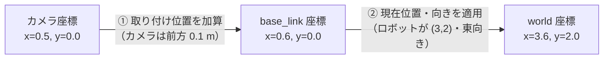
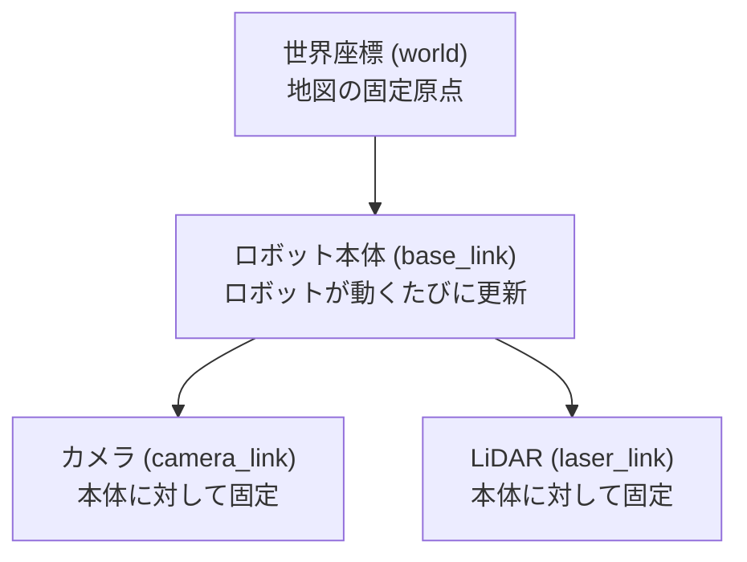

# 12章: tf2 ── 座標変換

ロボットには「センサーの取り付け位置」「ロボット本体の向き」「地図上の位置」など，複数の「視点（座標系）」が同時に存在します．**tf2** はこれらの座標系間の変換を一元管理する ROS2 の標準ライブラリです．

---

## なぜ座標変換が必要か

**カメラがロボットの正面 0.5 m に物体を検出した．その物体は地図上のどこにあるか？**

計算には複数の情報が必要です：

1. **カメラ → ロボット本体**：カメラはロボットのどこに，どんな向きで取り付けられているか
2. **ロボット本体 → 世界地図**：ロボット自体が地図のどこにいて，どちらを向いているか



**tf2 はこの "座標系の連鎖" を自動で管理する仕組みです．**

---

## 座標フレームとは

**座標フレーム**（座標系）とは，「どこを原点にして，どの向きを基準にするか」を定めたものです．

ロボットシステムでは，たとえば次のようなフレームが登場します：

| フレーム名 | 原点の位置 | 主な用途 |
|-----------|-----------|---------|
| `world` | 起動時に固定された地図原点 | ナビゲーション，地図全体 |
| `base_link` | ロボット本体の中心 | ロボット全体の制御 |
| `camera_link` | カメラの光学中心 | 画像認識，物体検出 |
| `laser_link` | LiDAR のスキャン中心 | 障害物検出，SLAM |



---

## ビルド設定

### CMakeLists.txt の変更

```cmake
find_package(geometry_msgs REQUIRED)
find_package(tf2 REQUIRED)
find_package(tf2_ros REQUIRED)

add_executable(tf_broadcaster src/tf_broadcaster.cpp)
ament_target_dependencies(tf_broadcaster rclcpp geometry_msgs tf2 tf2_ros)

add_executable(tf_listener src/tf_listener.cpp)
ament_target_dependencies(tf_listener rclcpp geometry_msgs tf2 tf2_ros)

install(TARGETS tf_broadcaster tf_listener DESTINATION lib/${PROJECT_NAME})
```

### package.xml の変更

```xml
<depend>geometry_msgs</depend>
<depend>tf2</depend>
<depend>tf2_ros</depend>
```

---

## TransformBroadcaster（フレームを配信する）

`~/ros2_ws/src/ros_tutorial/src/tf_broadcaster.cpp` を作成：

```cpp
#include "rclcpp/rclcpp.hpp"
#include "tf2_ros/transform_broadcaster.h"
#include "geometry_msgs/msg/transform_stamped.hpp"
#include "tf2/LinearMath/Quaternion.h"
#include <cmath>

int main(int argc, char * argv[])
{
    rclcpp::init(argc, argv);
    auto node = rclcpp::Node::make_shared("tf_broadcaster");

    // TransformBroadcaster にノードを渡して作成
    auto br = std::make_shared<tf2_ros::TransformBroadcaster>(node);

    rclcpp::Rate rate(10);  // 10 Hz
    double t = 0.0;

    while (rclcpp::ok())
    {
        geometry_msgs::msg::TransformStamped ts;

        // ヘッダー：いつ・どの親フレームから子フレームへの変換か
        ts.header.stamp    = node->get_clock()->now();
        ts.header.frame_id = "world";      // 親フレーム
        ts.child_frame_id  = "base_link";  // 子フレーム

        // 位置：円運動（半径 1.0m）
        ts.transform.translation.x = std::cos(t);
        ts.transform.translation.y = std::sin(t);
        ts.transform.translation.z = 0.0;

        // 姿勢：進行方向を向く（yaw = t + 90°）
        tf2::Quaternion q;
        q.setRPY(0, 0, t + M_PI / 2.0);
        ts.transform.rotation.x = q.x();
        ts.transform.rotation.y = q.y();
        ts.transform.rotation.z = q.z();
        ts.transform.rotation.w = q.w();

        br->sendTransform(ts);

        t += 0.05;
        rclcpp::spin_some(node);
        rate.sleep();
    }

    rclcpp::shutdown();
    return 0;
}
```

### コードのポイント

| コード | 意味 |
|--------|------|
| `tf2_ros::TransformBroadcaster(node)` | ノードを渡して Broadcaster を作る（ROS1 との違い）|
| `ts.header.frame_id` | 親フレーム（基準となる座標系）|
| `ts.child_frame_id` | 子フレーム（変換先の座標系）|
| `tf2::Quaternion` | 回転をクォータニオンで表現 |
| `q.setRPY(r, p, y)` | RPY（Roll・Pitch・Yaw）をクォータニオンに変換 |
| `br->sendTransform(ts)` | tf ツリーにフレームを配信 |
| `node->get_clock()->now()` | 現在時刻を取得（ROS1 の `ros::Time::now()` に相当）|

---

## TransformListener（変換を受け取る）

`~/ros2_ws/src/ros_tutorial/src/tf_listener.cpp` を作成：

```cpp
#include "rclcpp/rclcpp.hpp"
#include "tf2_ros/transform_listener.h"
#include "tf2_ros/buffer.h"
#include "geometry_msgs/msg/transform_stamped.hpp"
#include "tf2/exceptions.h"

int main(int argc, char * argv[])
{
    rclcpp::init(argc, argv);
    auto node = rclcpp::Node::make_shared("tf_listener");

    // Buffer にノードのクロックを渡す（ROS2 の変更点）
    auto tf_buffer   = std::make_shared<tf2_ros::Buffer>(node->get_clock());
    auto tf_listener = std::make_shared<tf2_ros::TransformListener>(*tf_buffer, node);

    rclcpp::Rate rate(1.0);  // 1 Hz

    while (rclcpp::ok())
    {
        geometry_msgs::msg::TransformStamped ts;
        try
        {
            // "world" から "base_link" への最新の変換を取得
            // tf2::TimePointZero = 最新の変換を取得（ROS1 の ros::Time(0) に相当）
            ts = tf_buffer->lookupTransform("world", "base_link",
                                            tf2::TimePointZero);

            RCLCPP_INFO(node->get_logger(),
                        "base_link の位置: x=%.2f, y=%.2f",
                        ts.transform.translation.x,
                        ts.transform.translation.y);
        }
        catch (tf2::TransformException & ex)
        {
            RCLCPP_WARN(node->get_logger(), "%s", ex.what());
        }

        rclcpp::spin_some(node);
        rate.sleep();
    }

    rclcpp::shutdown();
    return 0;
}
```

### コードのポイント

| コード | 意味 |
|--------|------|
| `tf2_ros::Buffer(node->get_clock())` | ノードのクロックを使う Buffer を作る |
| `tf2_ros::TransformListener(*tf_buffer, node)` | ノードにリスナーを登録する |
| `lookupTransform("world", "base_link", tf2::TimePointZero)` | 最新の変換を取得（`TimePointZero` = 最新）|
| `tf2::TransformException` | フレームがまだ存在しない場合に投げられる例外 |

> **ROS1 との違い**: `ros::Time(0)` の代わりに `tf2::TimePointZero` を使います．`Buffer` にクロックを渡す必要があります．

---

## ビルドと実行

```bash
cd ~/ros2_ws
colcon build --symlink-install --packages-select ros_tutorial
source install/setup.bash
```

**ターミナル 1：Broadcaster を起動**
```bash
ros2 run ros_tutorial tf_broadcaster
```

**ターミナル 2：Listener を起動**
```bash
ros2 run ros_tutorial tf_listener
```

出力例：
```
[INFO] [...] [tf_listener]: base_link の位置: x=1.00, y=0.05
[INFO] [...] [tf_listener]: base_link の位置: x=0.97, y=0.24
[INFO] [...] [tf_listener]: base_link の位置: x=0.88, y=0.48
```

---

## RViz2 での確認

```bash
rviz2
```

1. 左パネルの **「Add」** ボタンをクリック
2. **「TF」** を選択して **「OK」**
3. Global Options の「Fixed Frame」を `world` に設定

`base_link` フレームが `world` フレームを中心に円を描くように動くのが確認できます．

---

## 静的変換（Static Transform）

センサーの取り付け位置など，**変化しない変換**には `static_transform_publisher` を使います．

```bash
# ROS2 の書き方
ros2 run tf2_ros static_transform_publisher \
    --x 0.1 --y 0 --z 0.2 \
    --yaw 0 --pitch 0 --roll 0 \
    --frame-id base_link --child-frame-id camera_link
```

launch ファイルでの書き方：

```python
from launch_ros.actions import Node

Node(
    package='tf2_ros',
    executable='static_transform_publisher',
    name='camera_tf',
    arguments=['--x', '0.1', '--y', '0', '--z', '0.2',
               '--yaw', '0', '--pitch', '0', '--roll', '0',
               '--frame-id', 'base_link', '--child-frame-id', 'camera_link'],
)
```

---

## tf2 関連コマンドまとめ

```bash
# tf2_tools のインストール（必要な場合）
sudo apt install ros-humble-tf2-tools -y

# フレームツリーを PDF に出力
ros2 run tf2_tools view_frames

# 特定フレーム間の変換を表示し続ける
ros2 run tf2_ros tf2_echo world base_link
```

---

[→ 13章: C++ クラス入門](13_cpp_class_basics.md)
