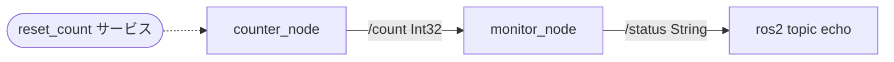
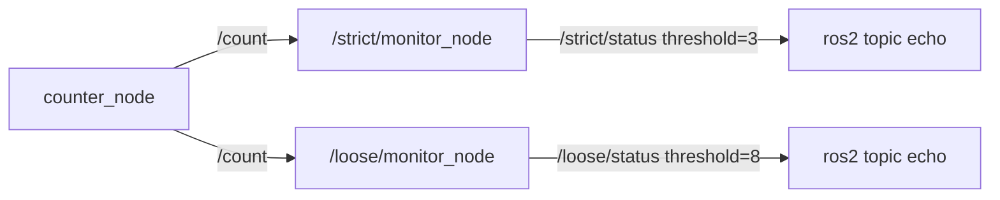
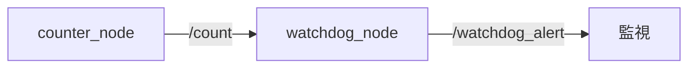

# 15章: ROS2 総合演習 ── マルチノードシステムを組み立てる

1〜14章で学んだ個別の概念を**組み合わせて**動く小さなシステムを作ります．

---

## この章で作るもの

カウントアップしながら閾値を監視する 2 ノードシステムです．



| ノード | 役割 |
|--------|------|
| `counter_node` | 整数をカウントアップして `/count` に publish |
| `monitor_node` | `/count` を受け取り，閾値を超えたら `/status` に警告を publish |

使用する概念：

| 章 | 概念 |
|----|------|
| 4章 | Publisher / Subscriber |
| 5章 | サービス |
| 8章 | パラメータ |
| 9章 | launch ファイル |
| 14章 | クラスを使ったノード |

---

## パッケージの準備

1〜14章で作った `ros_tutorial` パッケージはそのまま残し，この章専用の新しいパッケージを作成します．

```bash
cd ~/ros2_ws/src
ros2 pkg create ros_exercises --build-type ament_cmake \
    --dependencies rclcpp std_msgs std_srvs
```

一度ビルドしておきます：

```bash
cd ~/ros2_ws
colcon build --symlink-install --packages-select ros_exercises
source install/setup.bash
```

---

## CounterNode を作る

### 仕様

- `/count` に `std_msgs/msg/Int32` を一定周期で publish
- サービス `reset_count`（`std_srvs/srv/Empty`）でカウントを 0 にリセット
- パラメータ `rate` でパブリッシュ周波数を変更できる（デフォルト: 1.0 Hz）

`~/ros2_ws/src/ros_exercises/src/counter_node.cpp` を作成：

```cpp
#include "rclcpp/rclcpp.hpp"
#include "std_msgs/msg/int32.hpp"
#include "std_srvs/srv/empty.hpp"

class CounterNode : public rclcpp::Node
{
public:
    CounterNode() : Node("counter_node"), count_(0)
    {
        // パラメータの宣言と取得
        this->declare_parameter("rate", 1.0);
        double rate = this->get_parameter("rate").as_double();

        pub_   = this->create_publisher<std_msgs::msg::Int32>("count", 10);
        srv_   = this->create_service<std_srvs::srv::Empty>(
            "reset_count",
            std::bind(&CounterNode::reset_callback, this,
                      std::placeholders::_1, std::placeholders::_2));
        timer_ = this->create_wall_timer(
            std::chrono::duration<double>(1.0 / rate),
            std::bind(&CounterNode::timer_callback, this));

        RCLCPP_INFO(this->get_logger(), "CounterNode 起動 (rate=%.1f Hz)", rate);
    }

private:
    void timer_callback()
    {
        auto msg = std_msgs::msg::Int32();
        msg.data = count_++;
        pub_->publish(msg);
        RCLCPP_INFO(this->get_logger(), "count: %d", msg.data);
    }

    void reset_callback(const std::shared_ptr<std_srvs::srv::Empty::Request>,
                        std::shared_ptr<std_srvs::srv::Empty::Response>)
    {
        RCLCPP_INFO(this->get_logger(), "カウントをリセット");
        count_ = 0;
    }

    rclcpp::Publisher<std_msgs::msg::Int32>::SharedPtr pub_;
    rclcpp::Service<std_srvs::srv::Empty>::SharedPtr   srv_;
    rclcpp::TimerBase::SharedPtr timer_;
    int count_;
};

int main(int argc, char * argv[])
{
    rclcpp::init(argc, argv);
    rclcpp::spin(std::make_shared<CounterNode>());
    rclcpp::shutdown();
    return 0;
}
```

### ポイント

- `std_srvs::srv::Empty` はリクエスト・レスポンスともに空のサービス型（ROS2 では `std_srvs/srv/empty.hpp`）
- `std::chrono::duration<double>(1.0 / rate)` でパラメータからタイマー周期を設定

---

## MonitorNode を作る

### 仕様

- `/count` を subscribe
- 受け取った値を `/status`（`std_msgs/msg/String`）に publish
  - 閾値未満 → `"Normal: <値>"`
  - 閾値以上 → `"[ALERT] count reached <値>!"`
- パラメータ `threshold` で閾値を設定（デフォルト: 5）

`~/ros2_ws/src/ros_exercises/src/monitor_node.cpp` を作成：

```cpp
#include "rclcpp/rclcpp.hpp"
#include "std_msgs/msg/int32.hpp"
#include "std_msgs/msg/string.hpp"

class MonitorNode : public rclcpp::Node
{
public:
    MonitorNode() : Node("monitor_node")
    {
        this->declare_parameter("threshold", 5);
        threshold_ = this->get_parameter("threshold").as_int();

        sub_ = this->create_subscription<std_msgs::msg::Int32>(
            "count", 10,
            std::bind(&MonitorNode::count_callback, this, std::placeholders::_1));
        pub_ = this->create_publisher<std_msgs::msg::String>("status", 10);

        RCLCPP_INFO(this->get_logger(), "MonitorNode 起動 (threshold=%d)", threshold_);
    }

private:
    void count_callback(const std_msgs::msg::Int32::SharedPtr msg)
    {
        auto status = std_msgs::msg::String();

        if (msg->data >= threshold_) {
            status.data = "[ALERT] count reached " + std::to_string(msg->data) + "!";
            RCLCPP_WARN(this->get_logger(), "%s", status.data.c_str());
        } else {
            status.data = "Normal: " + std::to_string(msg->data);
            RCLCPP_INFO(this->get_logger(), "%s", status.data.c_str());
        }

        pub_->publish(status);
    }

    rclcpp::Subscription<std_msgs::msg::Int32>::SharedPtr sub_;
    rclcpp::Publisher<std_msgs::msg::String>::SharedPtr   pub_;
    int threshold_;
};

int main(int argc, char * argv[])
{
    rclcpp::init(argc, argv);
    rclcpp::spin(std::make_shared<MonitorNode>());
    rclcpp::shutdown();
    return 0;
}
```

---

## CMakeLists.txt に追加

`~/ros2_ws/src/ros_exercises/CMakeLists.txt` を更新（`ament_package()` の前）：

```cmake
add_executable(counter_node src/counter_node.cpp)
ament_target_dependencies(counter_node rclcpp std_msgs std_srvs)

add_executable(monitor_node src/monitor_node.cpp)
ament_target_dependencies(monitor_node rclcpp std_msgs)

install(TARGETS counter_node monitor_node
  DESTINATION lib/${PROJECT_NAME})
```

---

## 個別に動かして確認する

```bash
cd ~/ros2_ws && colcon build --symlink-install --packages-select ros_exercises
source install/setup.bash
```

**ターミナル 1：**
```bash
ros2 run ros_exercises counter_node --ros-args -p rate:=1.0
```

**ターミナル 2：**
```bash
ros2 run ros_exercises monitor_node --ros-args -p threshold:=5
```

**ターミナル 3（確認用）：**
```bash
ros2 topic echo /status
```

カウントが 5 に達すると MonitorNode が `[ALERT]` を出力します．

**リセットを試す：**
```bash
ros2 service call /reset_count std_srvs/srv/Empty
```

---

## launch ファイルでまとめて起動

`~/ros2_ws/src/ros_exercises/launch/monitor_system.launch.py` を作成：

```python
from launch import LaunchDescription
from launch_ros.actions import Node

def generate_launch_description():
    return LaunchDescription([
        Node(
            package='ros_exercises',
            executable='counter_node',
            name='counter_node',
            output='screen',
            parameters=[{'rate': 2.0}],
        ),
        Node(
            package='ros_exercises',
            executable='monitor_node',
            name='monitor_node',
            output='screen',
            parameters=[{'threshold': 8}],
        ),
    ])
```

`CMakeLists.txt` に launch ディレクトリのインストールを追加：

```cmake
install(DIRECTORY launch
  DESTINATION share/${PROJECT_NAME})
```

```bash
colcon build --symlink-install --packages-select ros_exercises
source install/setup.bash
ros2 launch ros_exercises monitor_system.launch.py
```

2 Hz でカウントアップし，8 に達すると警告が表示されます．

---

## 演習

### 演習 1: 最大値で自動停止

CounterNode に「カウントが `max_count` に達したら自動的にノードを終了する」機能を追加してください．

```bash
# max_count=10 で起動（10 カウント後に終了）
ros2 run ros_exercises counter_node --ros-args -p max_count:=10
```

**ヒント：**
- コンストラクタで `this->declare_parameter("max_count", 10)` を追加
- `timer_callback` 内で `count_` が `max_count_` を超えたら `rclcpp::shutdown()` を呼ぶ

<details>
<summary>サンプルコード（考えてから開くこと！）</summary>

コンストラクタに追加：
```cpp
this->declare_parameter("max_count", 10);
max_count_ = this->get_parameter("max_count").as_int();
```

`timer_callback` に追加：
```cpp
if (count_ > max_count_) {
    RCLCPP_INFO(this->get_logger(), "max_count (%d) に達しました．終了します", max_count_);
    rclcpp::shutdown();
    return;
}
```

メンバ変数に `int max_count_` を宣言してください．

</details>

---

### 演習 2: rosbag2 で記録して再生

動作中のシステムを rosbag2 で記録し，再生してみましょう（11章の復習）．

```bash
# システムを起動した状態で別ターミナルから記録開始
ros2 bag record /count /status -o monitor_system

# しばらく動かしてから Ctrl-C で停止

# ノードを停止し，bag を再生
ros2 bag play monitor_system
```

`ros2 topic echo /status` で記録した /status が再生されていることを確認してください．

---

### 演習 3: カスタムメッセージでステータスを拡張する

MonitorNode が publish するステータスを `std_msgs/msg/String` から**カスタムメッセージ**に置き換えてください（7章の復習）．

#### カスタムメッセージの定義

```bash
mkdir -p ~/ros2_ws/src/ros_exercises/msg
```

`~/ros2_ws/src/ros_exercises/msg/CounterStatus.msg` を作成：

```
int32   value         # カウント値
bool    is_alert      # 閾値超えのとき true
float64 elapsed_time  # カウント開始からの経過秒数
```

#### 変更点

MonitorNode を以下のように変更します：

- `pub_` が publish する型を `ros_exercises::msg::CounterStatus` に変更
- `start_time_`（`rclcpp::Time`）をコンストラクタで初期化しメンバ変数として保持
- `count_callback` 内で `CounterStatus` を組み立てて publish

#### 動作確認

```bash
ros2 topic echo /status
```

出力例：
```
value: 7
is_alert: true
elapsed_time: 7.023
---
```

<details>
<summary>サンプルコード（考えてから開くこと！）</summary>

`CMakeLists.txt` を以下のように変更します：

```cmake
find_package(rosidl_default_generators REQUIRED)

rosidl_generate_interfaces(${PROJECT_NAME}
  "msg/CounterStatus.msg"
  DEPENDENCIES std_msgs
)

rosidl_get_typesupport_target(cpp_typesupport_target ${PROJECT_NAME} "rosidl_typesupport_cpp")

add_executable(monitor_node src/monitor_node.cpp)
ament_target_dependencies(monitor_node rclcpp std_msgs)
target_link_libraries(monitor_node ${cpp_typesupport_target})
```

`package.xml` に追加：
```xml
<build_depend>rosidl_default_generators</build_depend>
<exec_depend>rosidl_default_runtime</exec_depend>
<member_of_group>rosidl_interface_packages</member_of_group>
```

`monitor_node.cpp` の変更部分：
```cpp
#include "ros_exercises/msg/counter_status.hpp"

// コンストラクタ内
pub_        = this->create_publisher<ros_exercises::msg::CounterStatus>("status", 10);
start_time_ = this->get_clock()->now();

// count_callback 内
auto status = ros_exercises::msg::CounterStatus();
status.value        = msg->data;
status.is_alert     = (msg->data >= threshold_);
status.elapsed_time = (this->get_clock()->now() - start_time_).seconds();

pub_->publish(status);

// メンバ変数として追加
rclcpp::Time start_time_;
```

</details>

---

### 演習 4: 2 つの MonitorNode を名前空間で並走させる

**1 つの CounterNode** に対して，**閾値の異なる 2 つの MonitorNode** を同時に動かしてください．

#### 期待する動作



<details>
<summary>launch ファイルのサンプル（考えてから開くこと！）</summary>

`~/ros2_ws/src/ros_exercises/launch/multi_monitor.launch.py` を作成：

```python
from launch import LaunchDescription
from launch_ros.actions import Node

def generate_launch_description():
    return LaunchDescription([
        Node(
            package='ros_exercises',
            executable='counter_node',
            name='counter_node',
            output='screen',
            parameters=[{'rate': 1.0}],
        ),
        Node(
            package='ros_exercises',
            executable='monitor_node',
            name='monitor_node',
            namespace='strict',
            output='screen',
            parameters=[{'threshold': 3}],
            remappings=[('count', '/count')],   # 名前空間に入ると /strict/count になるため，/count にリマップ
        ),
        Node(
            package='ros_exercises',
            executable='monitor_node',
            name='monitor_node',
            namespace='loose',
            output='screen',
            parameters=[{'threshold': 8}],
            remappings=[('count', '/count')],
        ),
    ])
```

起動後に確認：
```bash
ros2 node list
# /counter_node
# /strict/monitor_node
# /loose/monitor_node

ros2 topic list
# /count
# /strict/status
# /loose/status
```

</details>

---

### 演習 5: アクションサーバーでカウントを制御する

**アクションサーバー** として動く `CountUpServer` を作ってください（6章のアクション通信 + 14章のクラス設計の統合演習）．

#### アクションの仕様

```bash
mkdir -p ~/ros2_ws/src/ros_exercises/action
```

`~/ros2_ws/src/ros_exercises/action/CountUpAction.action` を作成：

```
# ゴール
int32 target
---
# 結果
string message
int32  final_count
---
# フィードバック
int32 current_count
```

#### サーバーの動作

1. ゴール（`target`）を受け取ったら，1 秒ごとにカウントアップ
2. 毎秒，現在のカウントをフィードバックとして送信
3. `target` に達したら結果を返して完了
4. キャンセルされたら途中で停止し，その時点の `final_count` を返す

#### 動作確認

```bash
# コマンドラインからゴールを送信
ros2 action send_goal /count_up ros_exercises/action/CountUpAction "{target: 5}" --feedback
```

<details>
<summary>サンプルコード（考えてから開くこと！）</summary>

`count_up_server.cpp`：

```cpp
#include "rclcpp/rclcpp.hpp"
#include "rclcpp_action/rclcpp_action.hpp"
#include "ros_exercises/action/count_up_action.hpp"

using CountUpAction = ros_exercises::action::CountUpAction;
using GoalHandle    = rclcpp_action::ServerGoalHandle<CountUpAction>;

class CountUpServer : public rclcpp::Node
{
public:
    CountUpServer() : Node("count_up_server")
    {
        action_server_ = rclcpp_action::create_server<CountUpAction>(
            this, "count_up",
            std::bind(&CountUpServer::handle_goal,     this, std::placeholders::_1, std::placeholders::_2),
            std::bind(&CountUpServer::handle_cancel,   this, std::placeholders::_1),
            std::bind(&CountUpServer::handle_accepted, this, std::placeholders::_1));
        RCLCPP_INFO(this->get_logger(), "CountUpServer 起動");
    }

private:
    rclcpp_action::GoalResponse handle_goal(
        const rclcpp_action::GoalUUID &,
        std::shared_ptr<const CountUpAction::Goal> goal)
    {
        RCLCPP_INFO(this->get_logger(), "ゴール受信: target=%d", goal->target);
        return rclcpp_action::GoalResponse::ACCEPT_AND_EXECUTE;
    }

    rclcpp_action::CancelResponse handle_cancel(const std::shared_ptr<GoalHandle>)
    {
        return rclcpp_action::CancelResponse::ACCEPT;
    }

    void handle_accepted(const std::shared_ptr<GoalHandle> goal_handle)
    {
        std::thread{std::bind(&CountUpServer::execute, this, std::placeholders::_1),
                    goal_handle}.detach();
    }

    void execute(const std::shared_ptr<GoalHandle> goal_handle)
    {
        auto result   = std::make_shared<CountUpAction::Result>();
        auto feedback = std::make_shared<CountUpAction::Feedback>();
        const auto goal = goal_handle->get_goal();

        rclcpp::Rate rate(1.0);
        for (int i = 0; i <= goal->target; ++i) {
            if (goal_handle->is_canceling()) {
                RCLCPP_INFO(this->get_logger(), "キャンセル (count=%d)", i);
                result->message     = "cancelled";
                result->final_count = i;
                goal_handle->canceled(result);
                return;
            }
            feedback->current_count = i;
            goal_handle->publish_feedback(feedback);
            RCLCPP_INFO(this->get_logger(), "count: %d / %d", i, goal->target);
            rate.sleep();
        }
        result->message     = "完了";
        result->final_count = goal->target;
        goal_handle->succeed(result);
        RCLCPP_INFO(this->get_logger(), "完了！");
    }

    rclcpp_action::Server<CountUpAction>::SharedPtr action_server_;
};

int main(int argc, char * argv[])
{
    rclcpp::init(argc, argv);
    rclcpp::spin(std::make_shared<CountUpServer>());
    rclcpp::shutdown();
    return 0;
}
```

`CMakeLists.txt` に追加：

```cmake
find_package(rclcpp_action REQUIRED)
find_package(rosidl_default_generators REQUIRED)

rosidl_generate_interfaces(${PROJECT_NAME}
  "action/CountUpAction.action"
  DEPENDENCIES std_msgs
)

rosidl_get_typesupport_target(cpp_typesupport_target ${PROJECT_NAME} "rosidl_typesupport_cpp")

add_executable(count_up_server src/count_up_server.cpp)
ament_target_dependencies(count_up_server rclcpp rclcpp_action)
target_link_libraries(count_up_server ${cpp_typesupport_target})

install(TARGETS count_up_server DESTINATION lib/${PROJECT_NAME})
```

</details>

---

## 発展演習

---

### 演習 6: ウォッチドッグタイマー ── 通信断を検知する

#### 仕様

`WatchdogNode` を作成：

- `/count` を subscribe し，受信のたびに最終受信時刻を更新
- 1 秒ごとに経過時間をチェック
- `timeout` パラメータ（デフォルト 3.0 秒）を超えたら `/watchdog_alert`（`std_msgs/msg/Bool`）に `true` を publish
- 通信が回復したら `false` に戻す



<details>
<summary>サンプルコード（考えてから開くこと！）</summary>

```cpp
#include "rclcpp/rclcpp.hpp"
#include "std_msgs/msg/int32.hpp"
#include "std_msgs/msg/bool.hpp"

class WatchdogNode : public rclcpp::Node
{
public:
    WatchdogNode() : Node("watchdog_node")
    {
        this->declare_parameter("timeout", 3.0);
        timeout_ = this->get_parameter("timeout").as_double();

        sub_   = this->create_subscription<std_msgs::msg::Int32>(
            "count", 10,
            std::bind(&WatchdogNode::count_callback, this, std::placeholders::_1));
        pub_   = this->create_publisher<std_msgs::msg::Bool>("watchdog_alert", 10);
        timer_ = this->create_wall_timer(
            std::chrono::seconds(1),
            std::bind(&WatchdogNode::check_callback, this));

        last_received_ = this->get_clock()->now();
        RCLCPP_INFO(this->get_logger(), "WatchdogNode 起動 (timeout=%.1f s)", timeout_);
    }

private:
    void count_callback(const std_msgs::msg::Int32::SharedPtr)
    {
        last_received_ = this->get_clock()->now();
    }

    void check_callback()
    {
        double elapsed = (this->get_clock()->now() - last_received_).seconds();

        auto alert = std_msgs::msg::Bool();
        alert.data = (elapsed > timeout_);
        pub_->publish(alert);

        if (alert.data)
            RCLCPP_WARN(this->get_logger(), "通信断: /count が %.1f 秒届いていません", elapsed);
    }

    rclcpp::Subscription<std_msgs::msg::Int32>::SharedPtr sub_;
    rclcpp::Publisher<std_msgs::msg::Bool>::SharedPtr     pub_;
    rclcpp::TimerBase::SharedPtr timer_;
    rclcpp::Time last_received_;
    double timeout_;
};

int main(int argc, char * argv[])
{
    rclcpp::init(argc, argv);
    rclcpp::spin(std::make_shared<WatchdogNode>());
    rclcpp::shutdown();
    return 0;
}
```

`CMakeLists.txt` に追加：
```cmake
add_executable(watchdog_node src/watchdog_node.cpp)
ament_target_dependencies(watchdog_node rclcpp std_msgs)
install(TARGETS watchdog_node DESTINATION lib/${PROJECT_NAME})
```

</details>

---

### 演習 7: YAML ファイルでパラメータを一元管理する

> 演習 6（`watchdog_node`）を完了してから取り組んでください．

#### 設定ファイルの作成

```bash
mkdir -p ~/ros2_ws/src/ros_exercises/config
```

`~/ros2_ws/src/ros_exercises/config/monitor_system.yaml` を作成：

```yaml
counter_node:
  ros__parameters:
    rate: 2.0
    max_count: 20

monitor_node:
  ros__parameters:
    threshold: 8

watchdog_node:
  ros__parameters:
    timeout: 3.0
```

> **ROS2 の YAML フォーマット**: `ノード名:` → `ros__parameters:` の階層が必要です（`ros__parameters` はアンダースコア 2 つ）．

#### launch ファイルの変更

`monitor_system.launch.py` を以下のように変更します：

```python
from launch import LaunchDescription
from launch_ros.actions import Node
from ament_index_python.packages import get_package_share_directory
import os

def generate_launch_description():
    config = os.path.join(
        get_package_share_directory('ros_exercises'),
        'config', 'monitor_system.yaml')

    return LaunchDescription([
        Node(package='ros_exercises', executable='counter_node',  name='counter_node',
             output='screen', parameters=[config]),
        Node(package='ros_exercises', executable='monitor_node',  name='monitor_node',
             output='screen', parameters=[config]),
        Node(package='ros_exercises', executable='watchdog_node', name='watchdog_node',
             output='screen', parameters=[config]),
    ])
```

`CMakeLists.txt` に config ディレクトリのインストールを追加：
```cmake
install(DIRECTORY launch config
  DESTINATION share/${PROJECT_NAME})
```

#### 動作確認

```bash
colcon build --symlink-install --packages-select ros_exercises
source install/setup.bash
ros2 launch ros_exercises monitor_system.launch.py

# 別ターミナルでパラメータが読み込まれていることを確認
ros2 param list /counter_node
```

---

## まとめ

| 演習 | 使用する概念 |
|------|-------------|
| 演習 1: max_count で自動停止 | パラメータ（8章）|
| 演習 2: rosbag2 で記録・再生 | rosbag2（11章）|
| 演習 3: カスタムメッセージに拡張 | カスタムメッセージ（7章）|
| 演習 4: 2 つの MonitorNode を並走 | 名前空間・remap（9章）|
| 演習 5: アクションでカウントを制御 | アクション（6章）+ クラス（14章）|
| 演習 6: ウォッチドッグタイマー | タイマー・時刻演算（14章のパターン応用）|
| 演習 7: YAML パラメータ管理 | YAML 設定・launch ファイル（8・9章）|
